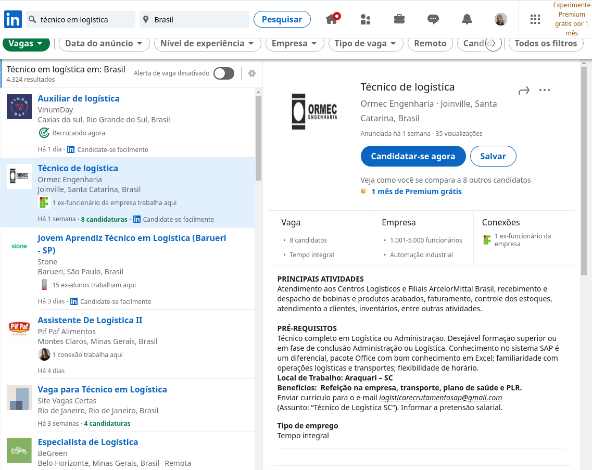
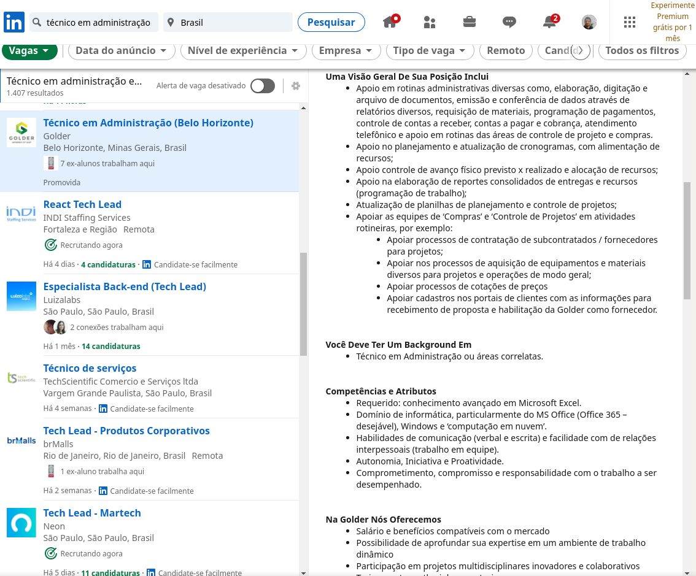
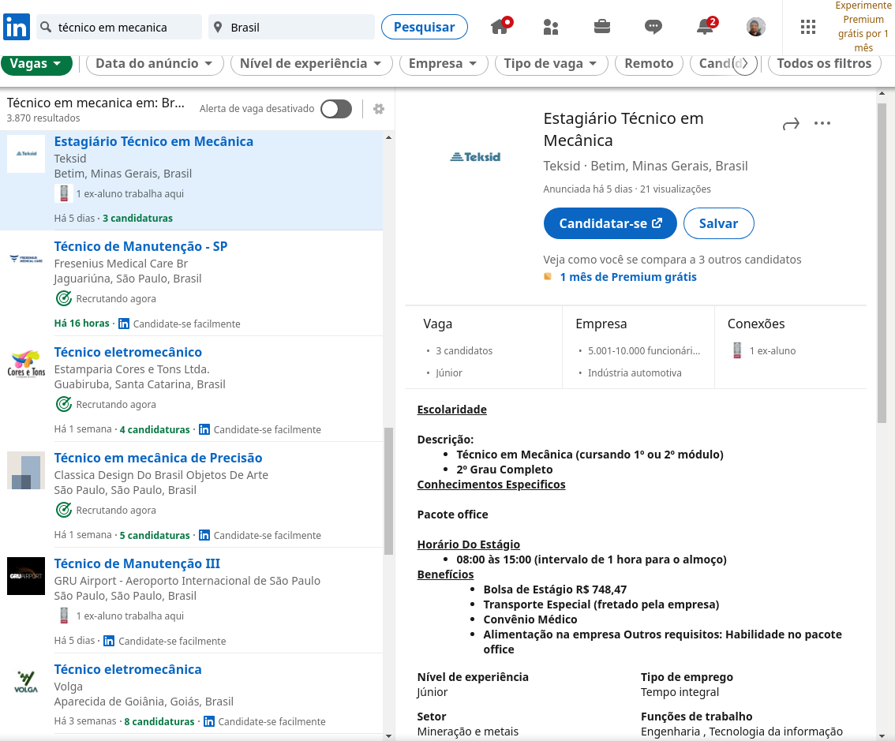

# 1. Por que é importante aprender informática?

Atualmente ter conhecimentos básicos de informática deixou de ser diferencial e se tornou essencial, básico, é como ter ensino médio completo. Apesar disso, muitos brasileiros, infelizmente, sequer tem ensino médio completo, como é apresentado na notícia "Mais da metade da população acima dos 25 anos não concluiu o ensino médio" \(Correio Braziliense, 2020\).

Além disso, segundo a pesquisa do Cetic.br \(CETIC, 2019\), 94% dos domicílios brasileiros em área urbana tem algum aparelho celular, mas apenas 26% tem notebook e só 16% tem computador de mesa. Ainda nesta pesquisa é informado que apenas 75% dos brasileiros de áreas urbanas tem acesso a internet e, este número, cai para 51% na área rural.

Em relação a emprego, segundo notícia de 2015, na época, cerca de 40% das vagas exigiam conhecimento no pacote Office, a saber 40% em Excel, 34% para Windows e Word. Um dado mais recente do site Ninja do Excel \(2019\), obtido a partir de 204 vagas do LinkedIn e Vagas.com, informa que 60% das empresas pedem explicitamente algum nível de Excel e apenas 40% pedem algum nível de inglês.

Por conta da pandemia do vírus da Covid-19, houve um aumento significativo no uso de serviços online, permitindo o teletrabalho \(ou trabalho remoto\) e o ensino remoto, uma realidade para quase todo brasileiro enquanto este texto é escrito, em maio de 2021.

Por fim, apresento algumas vagas de nível médio/técnico retiradas neste momento do LinkedIn, as vagas são para Técnico/Auxiliar de Administração, Técnico/Auxiliar de Logística e Técnico/Auxiliar de Mecânica, respectivamente.

**Vaga para Técnico/Auxiliar de Logística no Linkedin**

**Vaga para Técnico/Auxiliar de Administração no Linkedin**

**Vaga para Técnico/Auxiliar de Mecânica no Linkedin**

Assim, é nítida toda a importância do aprendizado de informática, sobretudo do pacote Office, seja para conseguir utilizar os serviços computacionais, seja para processos seletivos de emprego.

