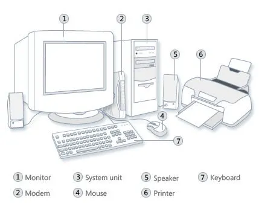
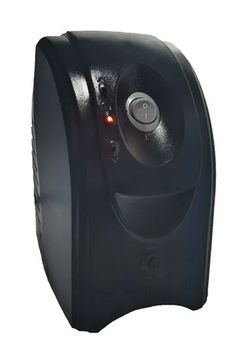
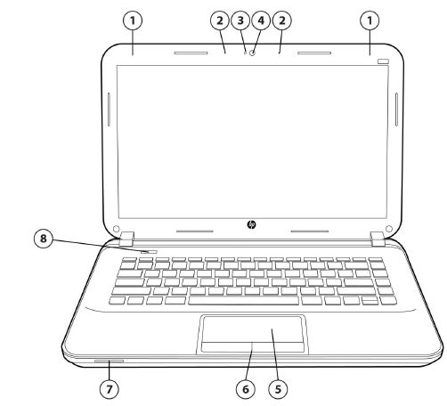
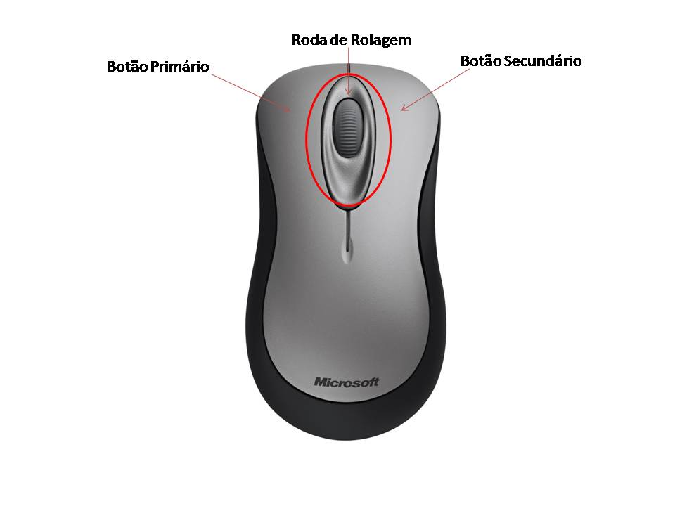
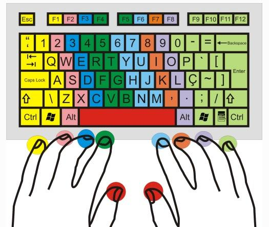

# 2. Como usar um computador

Se você não tem costume de ligar um computador, saiba que é algo bastante simples. A primeira coisa que você precisa saber é que você não irá estragar o computador caso não saiba usar adequadamente, é muito difícil estragar um computador.

Antes de tudo vamos conhecer os principais componentes de um computador. A Figura 4 indica os principais componentes, são eles:

 

1. Monitor, é a tela do computador, onde você vê as informações, aplicativos e tudo mais do computador.
2. Modem, é o dispositivo que recebe a internet do provedor que você contratou, poderiamos ter também um roteador que fornece a internet wi-fi para sua casa.
3. Computador. Está ilustrado pelo gabinete, pois o computador em si está dentro dessa caixa, o gabinete. Muitos chamam essa parte de CPU, porém não é o termo mais correto. Nessa peça temos o botão de ligar o computador, podemos ter um leitor/gravador de dvd/blu-ray e portas para conectar usb e fone de ouvido. Então se quer enviar algum dado para o ou do computador, conecte o celular na usb do computador.
4. Mouse. Peça fundamental para interagir com o computador, com ele você move a "setinha" \(cursor\) na tela e pode clicar em botões, abrir programas etc.
5. Caixa de som. Esse componente é simples de se entender, geralmente tem um botão para ligar e desligar.
6. Impressora. Equipamento muito útil para imprimir trabalhos, documentos etc. É preciso configurar.
7. Teclado. Outro componente fundamental. Com o teclado você pode digitar textos e usar atalhos, atalhos são combinações de teclas que realizam certas funções, como copiar um texto selecionado.

Na figura faltam alguns componentes, são eles:

* Webcam que é uma camera.
* Estabilizador de energia. É uma caixa que "funciona" quase como um filtro de linha ou uma extensão de tomada onde você pode conectar vários aparelhos ao mesmo tempo, ele geralmente tem um botão de ligar e desligar, abaixo tem uma foto \(Figura 5\) para conhecê-lo. O funcionamento de um estabilizador não será explicado aqui, também não explicarei se ele realmente é necessário, contudo muitos o utilizam.

Entendo que muitos hoje não tem computador, mas tem um notebook, caso tenha apenas um celular pense em comprar num futuro, pois o mercado de trabalho exige alguma experiência com computadores. No caso de Notebooks, os componentes costumam ser todos juntos. O notebook abaixo tem os seguintes componentes:

1. Antena Wi-fi \(localização depende do fabricante\)
2. Microfone interno
3. Luz da webcam
4. Webcam
5. Touchpad, é como um mouse do notebook.
6. Botões do touchpad. Funcionam como os botões do mouse.
7. Alto-falante, é como a caixa de som do computador.
8. Botão de ligar e desligar.

Na parte lateral temos portas USB para conectar dispositivos como um celular, portas de som para conectar um fone ou microfone, além da unidade de disco que serve para gravar ou ler CD/DVD/Blu-ray.

 

### 2.1 Como ligar e desligar um computador

Para ligar o computador, basta primeiro verificar se o computador e monitor estão ligados na tomada de energia elétrica, depois ligar o estabilizador, caso utilize, pressionar o botão de ligar no computador ou notebook e só.

Para desligar, basta clicar no menu Iniciar, clicar em desligar e depois em desligar novamente.

### 2.2 Como conectar os cabos de um computador

A conexão dos cabos é bastante simples, precisamos conectar o monitor na placa mãe \(placa de vídeo embutida\) ou placa de vídeo do computador, geralmente se usa uma conexão \(porta\) vga, dvi ou hdmi. Depois conectar mouse e teclado, hoje em dia usam conexão usb, o que é muito mais simples que as antigas PS/2, o cabo de rede \(cabo normalmente azul do tipo CAT 6, chamado ETHERNET, na porta RJ45\) ou usar a rede wi-fi. Conectar a caixa de som ou fone de ouvido e microfone nas portas P2 que podem ficar na frente ou atrás do computador ou na frente ou ao lado de um notebook.

Abaixo há um vídeo explicando visualmente como fazer caso você tenha alguma dúvida.



### 2.3 Cuidados com o computador

Os cuidados com o computador são poucos, como os cuidados com qualquer dispositivo eletrônico. Assim é interessante:

* Remover a poeira da superfície dos componentes externos do computador, todos aqueles das figuras 4 e 6;
* Tomar cuidado com descargas elétricas quando há tempestades com quedas de raios elétricos. Assim, é recomendado desligar e tirar o aparelho da tomada para evitar que sobrecargas na rede afetem o computador; Filtros de linha, estabilizadores e outros dispositivos podem ajudar, mas não resolvem o problema completamente, para isso precisaria de dispositivos mais específicos para segurança elétrica;
* Desligar o aparelho caso fique muito tempo sem utilizá-lo. Isso evita gasto desnecessário de energia elétrica;
* Realizar algumas vezes durante o ano a desfragmentação de disco e realizar a análise de anti-vírus sempre, caso utilize sistema Windows;

### 2.4 Botões do mouse

Um mouse tem ao menos três botões, como pode ser visto na Figura 7. sendo eles:

* Botão esquerdo: serve para clicar ou realizar o duplo clique, geralmente serve para acessar links, programas, selecionar textos etc.
* Botão direito: costuma ser usado para acessar menus de contexto, ou seja, menu relacionado ao local onde o cursor \(seta\) do mouse está.
* Rodinha: é um botão e uma rodinha de rolagem, este botão costuma ser usado para cliques diferentes, como abrir em nova aba em um navegador de internet. A rolagem é rolar a tela, um campo etc.

 

### 2.5 Uso do teclado

O teclado é composto por dezenas de teclas, como mostra a Figura 8, além disso cada tecla deveria ser acionada \(pressionada\) com um dedo específico, para isso há cursos de digitação. Recomendo os cursos gratuitos abaixo:

* [Typing Study](https://www.typingstudy.com/pt-brazilian_abnt-2/lesson/1)
* [Sense Lang](https://sense-lang.org/typing/portuguese.php?key=brasil)

 

### 2.6 Principais atalhos do teclado

A Tabela 1 apresenta os principais atalhos do teclado, vale ressaltar que é possível que cada sistema operacional ou programa pode ter os seus próprios atalhos, bem como cada idioma pode ter suas próprias combinações de teclas.

Tabela 1. Principais atalhos do teclado

| Combinação de teclas \(atalho\) | Função realizada |  |
| :--- | :--- | :--- |
| Ctrl + C / Ctrl + V | Copiar / Colar |  |
| Ctrl + F | Procurar |  |
| Ctrl + A ou Ctrl + T | Selecionar tudo |  |
| Alt + F4 | Fechar janela |  |
| Alt + ESC ou Alt + Tab | Alterna entre janelas/programas |  |
| Ctrl + X | Recortar |  |
| Ctrl + Z / Ctrl + Y | Desfazer / Refazer |  |

