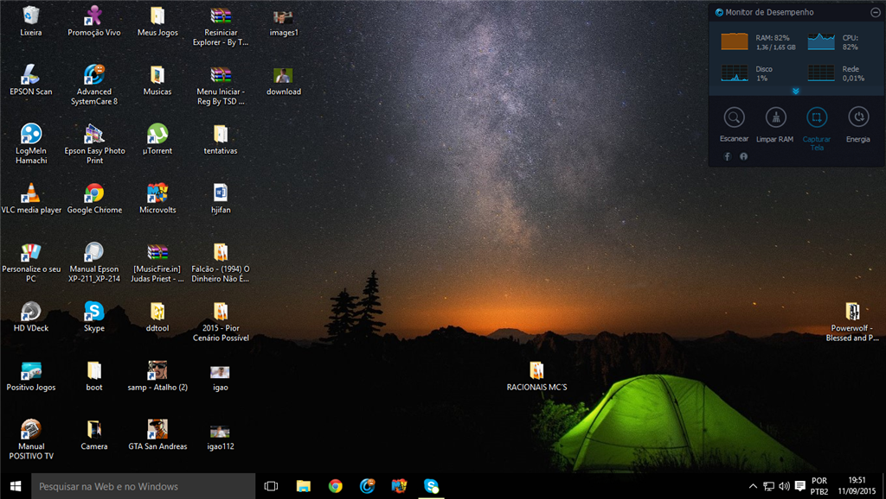

# 3. O que é um Sistema Operacional?

Um Sistema Operacional ou, abreviado, SO, é um programa que serve para gerenciar os recursos do computador e fornecer uma base para os programas que o usuário quer utilizar, como um editor de textos.

### 3.1 Organizacao dos dados

Antes é preciso conhecer alguns termos:

* Arquivos: é a materialização no computador de dados, como se fosse uma folha de papel que pode ter textos.
* Pastas: também chamadas de diretórios, são espaços para armazenar arquivos ou outras pastas. São como pastas para papeis, onde a pasta armazena papeis, logo um diretório armazena arquivos.

Os arquivos tem nome e extensão, por exemplo:

```text
nome-arquivo.txt
```

A primeira parte "nome-arquivo" pode ser escrita com diversos caracteres, até mesmo o espaço, ficando algo como "nome arquivo", porém não é muito recomendado o uso de espaços, é melhor usar o traço para separar. Isso se torna mais relevante quando se pensa no aprendizado de programação onde, até mesmo, acentos não são recomendados.

A extensão dos arquivos representa uma indicação para que o sistema operacional saiba qual programa usar para abrir o arquivo. Por exemplo, um arquivo com extensão txt, deve ser aberto com um leitor e escritor de textos, um pdf com um leitor de pdf, um mp3 com um reprodutor de áudio e, assim, por diante.

Porém há algumas coisas a se falar sobre formato de arquivo e extensão, são duas coisas diferentes. Formato de arquivo é o formato que o arquivo foi salvo, uma boa analogia é um formulário de matricula na UFJF, esse formulário tem um formato, já um formulário de matrícula para a UFRJ tem outro formato, ambos são formulários de matrícula, mas cada um tem um formato diferente. A extensão é apenas a indicação provável do tipo/formato do arquivo, mas ela não altera o formato do arquivo. Afinal, se você pegar o formulário de matrícula da UFJF e falar que é da UFRJ \(como se tivesse extensão ufrj\) e tentar usá-lo na matrícula da UFRJ, o que acontecerá? A UFRJ dirá que o formato está errado. Ou seja, se você tiver um arquivo em pdf e colocar a extensão como txt, ele continua sendo um pdf, mas a extensão está errada, talvez o sistema operacional tente abrir com um editor de texto, mas gerará erro.

### 3.2 Área de trabalho

A área de trabalho é como a sua mesa, mas virtual, é a tela 'inicial' do sistema operacional, a Figura 9 apresenta uma área de trabalho do Windows 10, nela podemos colocar arquivos, pastas, atalhos \(neste caso atalho é um link para uma página ou programa\).

 



### 3.3 Principais pastas

Cada Sistema Operacional tem os seus diretórios principais, mas costumam ser parecidas, no Windows temos: Documentos, Imagens, Downloads, mas você pode criar as suas pastas onde quiser e como quiser.

### 3.4 Quais os principais SOs

Existem Sistemas Operacionais ou Operativos para dispositivos móveis e para computadores de mesa/notebooks, abaixo apresento os principais:

* Windows: é o mais utilizado em computadores PC, seja de mesa ou notebooks. É um sistema pago, pois precisa comprar licença para utilizá-lo;
* Linux e suas distribuições: é o mais usado em servidores de sites e outros serviços web. Vale ressaltar, por curiosidade, que o Linux não é considerado por si só um SO, é considerado um Kernel de SO, ou seja, o núcleo do sistema. Uma distribuição Linux consiste em diversos recursos acoplados ao kernel Linux. É um sistema gratuito e de código-fonte aberto;
* MacOS: sistema utilizado em computadores Mac. É um sistema pago, pois precisa comprar licença para utilizá-lo;
* Android: sistema mais utilizado em aparelhos celulares \(_smartphones_\);
* iOs: sistema utilizado em celulares da Apple.

### 3.5 Software livre e o Linux

Software livre ou, em português, código-fonte livre é uma forma de distribuição de software, há várias, mas geralmente dividimos entre Software Livre que significa que o código-fonte está disponível na internet e a licença do software define como ele pode ser copiado, adaptado, utilizado e, até, comercializado. A outra forma é o software proprietário, onde temos um programa com código-fonte fechado, ou seja, onde apenas a empresa desenvolvedora tem acesso ao código.

O Linux é um grande exemplo de código-fonte livre, é muito utilizado por desenvolvedores de código, por exemplo, eu, Arthur Assuncao, utilizo distribuições Linux há quase uma decáda. Atualmente uso um sistema baseado no Arch Linux, porém comecei a vida com Linux com o famoso e popular Ubuntu. Assim, não tenho sequer Windows instalado em meu computador.

