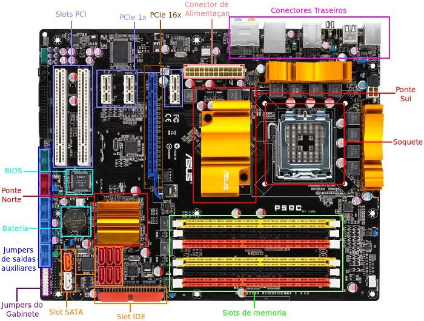
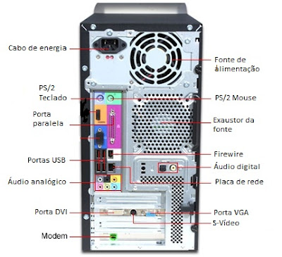

# 4. Hardware e Software

### **4.1 Hardware**

Antes de tudo precisamos falar da placa mãe. Ela é responsável por conectar todos os componentes, abaixo na Figura 10 é ilustrada uma placa mãe. Pode-se ver que há diversos _slots_, um slot é um espaço para colocar algum componente, por exemplo, slot de memória RAM é para colocar pentes (placas) de memória RAM, o Soquete (Socket) é comumente utilizado para colocar o processador, as conexões PCI são para placas de áudio, vídeo, rede e outras. A bateria serve para manter o relógio interno do computador funcionando, portanto se um computador sempre perder a hora após ser desligado, é bem provável que precise trocar a bateria do relógio dele, geralmente é o modelo CR2032 e custa por volta de R$ 5.

 

As conexões são feitas por meio de conectores que ficam na parte traseira nos computadores de mesa, como mostra a Figura 11.

 

Os componentes do computador podem ser divididos de algumas formas. Uma delas é pela natureza do componente, também chamado de categoria do dispositivo.

* memória (primária e secundária)
  * primária é acessada quase que diretamente pelo processador. É volátil que significa que é perdida ao desligar o computador. O maior exemplo é a memória RAM, que serve como se fosse o espaço de trabalho do computador. Ainda há outras memórias no computador, como a cache, que está no processador, e a ROM que é apenas de leitura, normalmente com dados da BIOS (Sistema Básico de Entrada e Saída).
  * secundária é também conhecida como de armazenamento em massa, os dados são armazenados de forma definitiva, podendo ser removido caso o usuário queira. O maior exemplo é o HD ou memória interna de celulares.
* unidade central de processamento (CPU): responsável pelos cálculos e todo processamento dos dados.
* unidades de entrada de dados: dispositivos que enviam dados para o computador, ou seja, o dado entra no computador ou na CPU para ser processado
* unidades de saída de dados: dispositivos que recebem dados para o computador, ou seja, o dado saí do computador ou da CPU para ser exibido ou utilizado pelo dispositivo.

Para que um componente tenha acesso aos outros na placa mãe, é preciso de um barramento, que é a ligação entre eles, é como se o barramento fosse uma rodovia e os componentes fossem as cidades. As siglas PCI, por exemplo, são barramentos, a PCI x16 é um dos barramentos mais rápidos, por isso ele costuma ser usado para conectar a placa de vídeo off-board.

O que seria off-board? Temos dois conceitos, on-board e off-board, que significam, respectivamente, uma placa embutida na placa mãe e uma placa acoplada a placa mãe, ou seja, a placa on-board é uma placa, como a de som, embutida, soldada na placa mãe e a off-board é uma placa externa que você compra separada, como uma placa de vídeo, e conecta à placa mãe por meio de um slot PCI.

### **4.2 Como montar um computador**

Se você acha que é difícil desmontar e montar um computador, saiba que é mais fácil que parece e é difícil você estragar um computador ou encaixar algo errado, pois os conectores geralmente só encaixam do jeito certo, abaixo há um vídeo que apresenta como montar um computador.



#### Instalação de uma memória RAM



#### Instalação placa de vídeo



### **4.3 Software**

Software é a parte lógica presente nos computadores e dispositivos eletrônicos, esta parte representa as instruções em código de máquina que são armazenados e processados pela CPU (Central Process Unit - Unidade Central de Processamento). Assim, é a camada sobre o _hardware_ que fornece interação com ele, ou seja, para interagirmos com o _hardware_, precisamos ter um software para isso. O software mais básico em um computador é a BIOS (Basic Input Output System - Sistema básico de entrada e saída) que fornece o mínimo para interagir com o _hardware_, acima dela temos o SO e, sobre ele, os programas para o usuário.

Esses programas ou _softwares_ são criados em diversas linguagens de programação, como C, C++, Java, JavaScript e muitas outras. Os compiladores das linguagens, quando disponíveis, convertem os códigos para código de máquina e os códigos de máquina são executados no computador de forma binária. Vale ressaltar que essa é uma explicação simplificada.

### **4.4 Sistema Binário**

Códigos binários são códigos formados por algarismos do sistema binário, diferente do decimal que tem 10 algarismos, 0 a 9, o binário tem apenas 2 algarismos, o 0 e 1.

Ta se perguntando qual o motivo de um computador utilizar o sistema binário? Simples, na eletrônica digital e de forma simplificada (em disciplinas de eletrônica você poderá aprender de forma mais detalhada e completa), há dois níveis de tensão, geralmente nível alto (com tensão, como 5 volts) ou nível baixo (sem tensão, como 0 volts), assim, o primeiro nível representa o 1 e o segundo o 0, dessa forma é possível representar diversas situações em um computador, dai também nasce a lógica booleana (verdadeiro e falso) e as portas lógicas que por meio de zeros e uns conseguem realizar diversos cálculos.

Na computação chamados os algarismos 1 e 0 de dígitos binários, ou seja, um número hipotético 1010 tem 4 dígitos binários ou 4 bits.

### **4.5 Unidades no Sistema Binário**

Sua internet tem qual "velocidade"? Seu hd tem quanto de espaço? Uma música tem quanto de "tamanho"? Um texto tem quanto de "tamanho"? Essas perguntas são comuns em nosso cotidiano e, por conta delas, saber um pouco sobre as unidades do sistema binário é muito importante, você sabe a diferença entre megabits e megabytes? Sabia que a "velocidade" da sua internet é vendida em megabits e que uma música é em megabytes?

Vamos lá. Sabemos que um digito binário é um bit. Agora você precisa saber que a computação usa 1024 e não 1000 como multiplicador de unidade. Na geografia e outras áreas temos as unidades de medida, como metro, sabemos que 1 kilometro são 1000 metros, na computação usamos 1024, veja.

* 1 kilobit (kb - perceba o b minúsculo) é igual a 1024 bits.
* 1 megabit (mb) é igual a 1024 kilobits (kb).
* 1 gigabit (gb) é igual a 1024 megabits (mb).

Há muitas outras, como terabit, petabit etc.

E os bytes?

* 1 byte são 8 bits.
* 1 kilobyte (KB - note o B maiúsculo) é igual a 1024 bytes.
* 1 megabyte (MB) é igual a 1024 kilobytes.
* 1 gigabyte (GB) é igual a 1024 megabytes.
* 1 terabyte (TB) é igual a 1024 gigabytes.

Agora vamos a algumas noções importantes, geralmente:

* um arquivo de texto tem alguns kilobytes (KB).
* um arquivo de música tem alguns megabytes (MB).
* um arquivo de filme tem alguns gigabytes (GB).
* um HD, atual, tem um ou alguns terabytes (TB).

Vamos voltar a nossa internet, por que a sua internet de 10 mega baixa a, no máximo, cerca de 1 mega? Lembra que te disse que a "velocidade" da sua internet é medida em bits? Então a sua internet é de 10 megabits por segundo (mb/s). Porém, o seu _download_ é feito em bytes, atualmente em megabytes, ou mais corretamente, em megabytes por segundo (MB/s), percebe que um é megabit e o outro em megabyte? Lembra que 1 byte são 8 bits? Então para converter megabit para megabyte precisamos dividir por 8. Logo a sua internet de 10 mb/s consegue realizar o _download_ em 1.25 MB/s. Bacana?!!

Agora vamos tirar um termo da sua cabeça, no texto eu estou sempre dizendo velocidade com aspas, sabe o porquê? Velocidade é da física e mede distância por tempo, como o carro que anda a 80 quilômetros por hora (KM/h), já os bits vão passando pelos cabos da internet a uma velocidade meio constante (depende do meio, como cabo de fibra ótica tem velocidade maior), mas você não quer saber se o bit chegou rápido na sua casa, você quer que chegue muitos bits para compor todo o arquivo da música, você quer saber a taxa de transferência, então o correto é dizer que a taxa de transferência da sua internet é de 10 mb/s. Mas, relaxa, ta tudo bem dizer velocidade, só não é o mais correto.

### **4.6 Drivers**

Um software muito útil em ambientes Windows é o _driver_, como o driver da placa de vídeo, é o _software_ específico para fazer a placa de vídeo, no caso, funcionar adequadamente. Assim, o Windows utiliza drivers para a correta utilização dos dispositivos do computador. O Linux e MacOS possuem _softwares_ similares, mas não são chamados de _drivers_, são conhecidos como módulos. Além disso, a maior parte dos "_drivers_" estão no _kernel_ do Linux, diminuindo a necessidade de instalação específica.

### **4.7 Principais Softwares**

#### **Navegadores Web**

Os navegadores web ou _web browsers_ são os programas mais usados em um computador, pois permitem o acesso direto a internet e todos os sites e sistemas hospedados nela. Os mais conhecidos são:

* Google Chrome
* Mozilla Firefox
* Microsoft Edge
* Safari

De longe, o Google Chrome é o mais utilizado, no dia 13 de maio de 2021, o Chrome representa 64.47% dos acesso à internet e, em segundo, o Safari com 18.69%, vale destacar que essa estatística inclui acesso de todos tipos de dispositivos, incluindo _smartphones_ (StatCounter GlobalStats, 2021).

#### **Antivirus**

Os anti-vírus são programas que tentam monitorar e analisar os arquivos do computador a fim de evitar que programas maliciosos sejam instalados ou executados no computador, assim, evitam que o computador seja infectado pelos diversos tipos de programas maliciosos.

Esses anti-vírus podem ter diversas funções e até acoplar outros softwares de segurança, como monitorar os arquivos, realizar checagem dos arquivos, _firewall_ (programa que monitora a entrada e saída de dados da internet), anti-vírus de navegador web (monitora os sites acessados) e mais.

Assim, são programas muito importantes para alguns sistemas operacionais, podemos destacar o Windows por ser o maior alvo de programas maliciosos. Ambientes Linux não costumam precisar de anti-vírus. Já os _smartphones_ podem utilizar anti-vírus, principalmente o Android, porém eu não considero necessário, principalmente porque esse tipo de programa tende a tornar o computador ou aparelho celular mais lento. É muito mais importante tomar cuidado com os sites que são acessados e os aplicativos que são instalados.

Os anti-vírus mais famosos são:

* Avira
* AVG
* MCAfee
* Karspesky
* Avast
* Malwarebytes
* BitDefender

#### **Desfragmentador de disco**

A fragmentação de disco acontece somente no Windows e consiste na situação onde os arquivos estão com suas partes separadas fisicamente no disco rígido (HD), ou seja, imagine que você tenha uma lista de 10 espaços, no segundo espaço tem uma maça, ai você precisa colocar 5 laranjas, você poderá colocar as laranjas no primeiro, terceiro, quarto, quinto e sexto espaços, ficaria algo como:

Laranja | Maçã | Laranja | Laranja | Laranja | Laranja

Percebe que as laranjas não estão organizadas de forma contínua? Agora imagine um HD com milhares de espaços, isso é fragmentação de disco, ela deixa a leitura e gravação de arquivos um pouco mais lenta, pois não é contínua. Para resolver isso usamos um Desfragmentador de disco, quando usamos esse programa, ele faz o seguinte com as nossas frutas:

Maçã | Laranja | Laranja | Laranja | Laranja | Laranja

Perceba que agora temos os dados de forma contínua, todas laranjas juntas. No HD é realizado um processo semelhante de rearranjo dos dados para ter o máximo possível de forma contínua.

É importante saber que o problema acontece com HD, pois ele tem partes internas que se movimentam de forma mecânica e, portanto, mais lenta. Em SSD acontece algum nível de fragmentação, porém não é recomendado realizar a desfragmentação de um SSD, pois gera desgaste no SSD e ele já tem um desempenho muito bom e não perde com a fragmentação. Por fim, o próprio Windows tem um desfragmentador de disco.

#### **Leitor de PDF**

O formato PDF é um formato de texto, muito comum em livros e apostilas, e permite a visualização de arquivos de forma idêntica em qualquer dispositivo, seja computador ou _smartphone_.

Os programas mais comuns são:

* Adobe Reader
* Foxit Reader
* Google Chrome (apesar de ser um navegador, ele abre arquivos pdf)

#### **Editor de imagem ou foto**

Editores de fotos são importantes programas e destaco os seguintes:

* Adobe Photoshop (pago)
* GIMP (gratuito)
* Canva (online)

#### **Editor de vídeo**

Editores de vídeo também podem ser importantes, inclusive gravadores de vídeo, para isso recomendo:

* KdenLive (gratuito)
* Lightworks (pago, mas tem versão gratuita com certas limitações)

#### **Compartilhamento de arquivos na nuvem**

Atualmente é mais benéfico salvar arquivos na nuvem que mantê-los no próprio computador, mas o que é essa nuvem? A nuvem são servidores na internet, apenas isso. Assim, você armazena os arquivos em servidores na internet e tem acesso de qualquer lugar, além de evitar o problema de perder arquivos caso o seu computador (principalmente o HD) estrague ou aconteça de você apagar os arquivos sem querer.

Os maiores serviços de compartilhamento de arquivos são:

* Google Drive (basta ter e-mail da Google, como o gmail)
* Dropbox
* OneDrive (basta ter e-mail da Microsoft, como o hotmail e outlook)

#### **Pacote Office**

Programas de escritório são, no mínimo, editores de texto, editores de planilha e editores de apresentação. São muito importantes para todas as áreas, pois a criação de texto, planilha eletrônica e apresentação acontece em todas as áreas de conhecimento e em, praticamente, todos os empregos.

Os três mais famosos são:

* Microsoft Office com Word, Excel e PowerPoint (pago)
* Libreoffice com Writer, Calc e Impress (gratuito)
* Google Docs (online e gratuito, basta ter uma conta Google)

#### **Cliente de e-mail**

Cliente de e-mail é o programa usado para gerenciar o e-mail, como enviar e ler e-mails. Atualmente é raro o uso de clientes de e-mail instalados no computador, mas existem alguns, como Outlook, Thunderbird. Mas é mais comum usar pelo navegador por meio do cliente de e-mail da própria empresa, como o Gmail, Outlook online e outros.

#### **Instalação dos softwares em Windows**

Para instalar programas no Windows é preciso acessar o site do fabricante e realizar o download do arquivo executável, no formato .exe. Ao baixar, ele deve ser executado.
