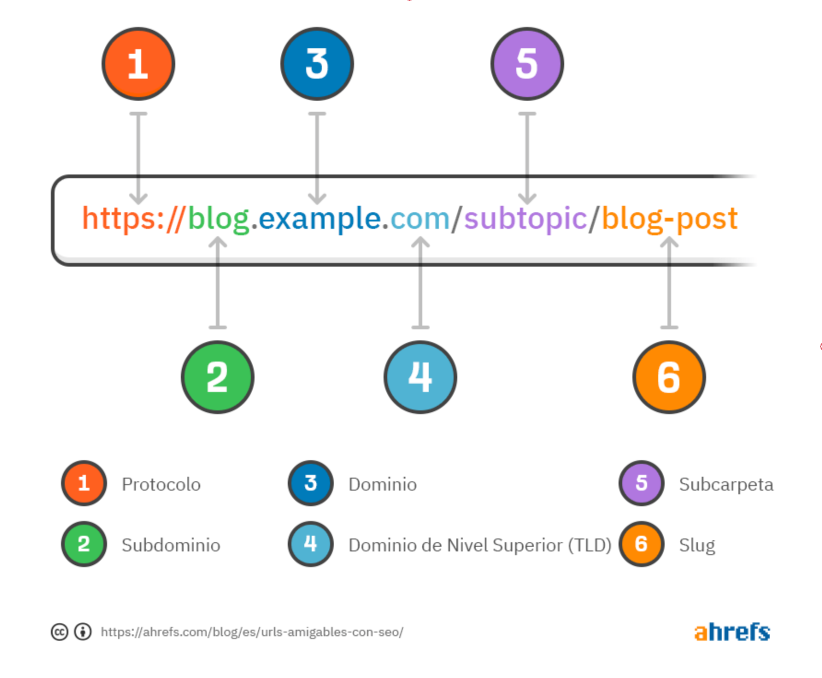
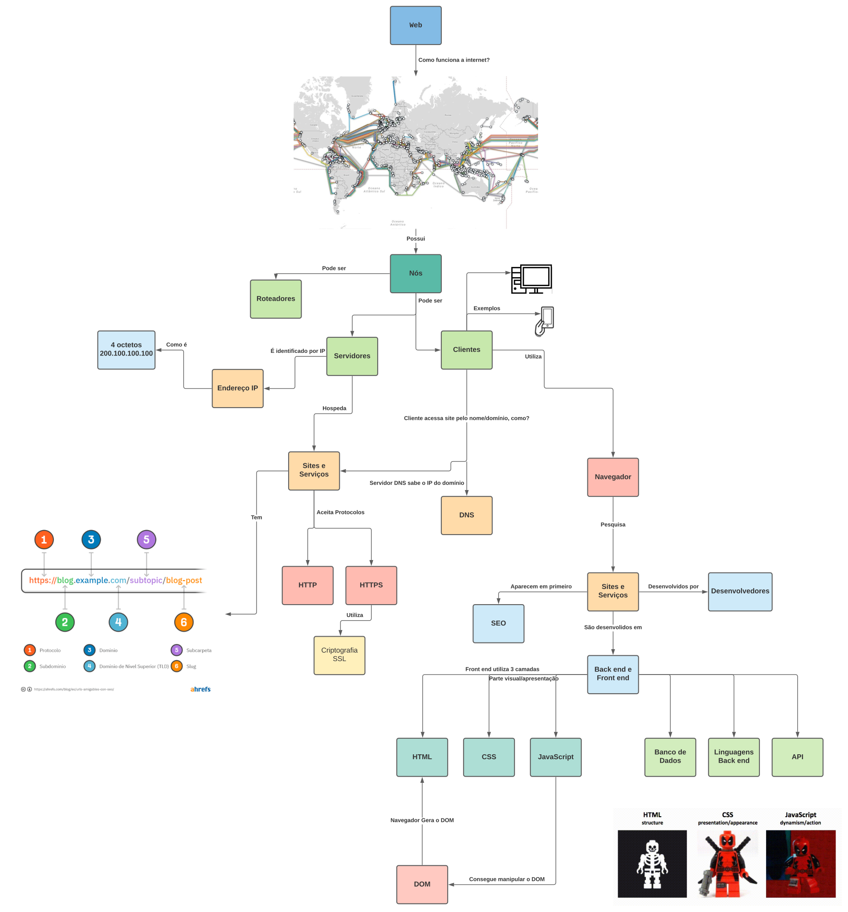
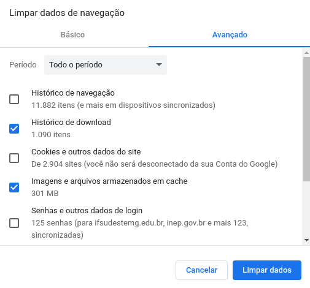

# 5. Internet e Navegadores

### 5.1 Como funciona a Internet

De forma simplificada, a internet funciona com a ligação milhares de computadores e dispositivos no mundo, onde cada dispositivo \(incluindo computador\) é um nó. Pense na sua casa ou da sua escola, há um roteador que recebe a internet do provedor e distribui por Wi-fi ou por rede cabeada \(cabos de internet\) para os computadores e celulares. Essa é como se fosse uma mini-internet \(é a sua rede local\), pois os dispositivos estão conectados entre si. Agora imagine isso a nível mundial, essa é a internet, uma rede de computadores com milhares/milhões de computadores, celulares, dispositivos inteligente, servidores \(computadores para armazenar sites e serviços web\), roteadores, switches \(aparelho que liga diversos computadores/servidores\) e outros componentes.

Cada dispositivo em uma rede ou na internet tem um endereço IP, que é um número como quatro partes, por exemplo: `200.100.100.100`

Quando você abre o seu navegador e acessa um site, você precisa acessar o endereço IP do servidor onde o site está hospedado, porém é difícil decorar endereços IPs, então foram criados nomes de sites ou domínios, assim você procura por facebook.com ao ínves do IP do facebook.com.

O endereço completo do site forma uma URL \(_Uniform Resource Locator_\), na Figura 12 temos um exemplo de URL com as suas partes, podemos ver que há o protocolo HTTP ou HTTPS, o HTTPS o protocolo garante maior segurança, pois utiliza criptografia SSL. Subdomínio, domínio e TLD podem ser resumidos a domínio. Tudo a partir da primeira "/" após o domínio, se refere ao caminho das pastas no servidor ou das rotas definidas pelos desenvolvedores do sistema.

 

Caso você queira uma explicação mais detalhada, tenho um vídeo que aborda todos os pontos da Figura 13. O vídeo está no link abaixo.



 

### 5.2 Navegando com um navegador de internet

Para utilizar um navegador de internet, basta abrir o navegador, seja ele o Edge ou Google Chrome ou outro e acessar um site por meio da sua barra de endereços. Caso não saiba qual site, utilize o serviço de busca do Google ou outro para pesquisar sites com o assunto que você tem interessse.

### 5.3 Navegação pela aba anônima

A aba anônima é um recurso muito útil para utilizar o navegador sem manter o histório de acesso à sites e para utilizar o navegador sem o cache, isso é muito útil quando algum site não funciona adequadamente. Portanto, caso um site não funcione, tente abrir o site por meio da Aba anônima. Para acessar ela você pode usar o atalho `Ctrl + Shift + N` ou ir no famoso "três pontinhos" ou configurações clicar em Nova janela anônima.

### 5.4 Limpar cache do navegador

O cache do navegador mantém senhas, fotos, histórico de download, cookies e mais. Quando algum site não abre corretamente, podemos pensar em limpar o cache para verificar se o site volta a funcionar, isso não é garantido e não vem ao caso quando essa técnica funciona. Além disso, para diminuir o gasto de espaço no disco, podemos apagar o cache, pois ele armazena todas fotos e outros arquivos acessados.

Para acessar as opções de limpeza do cache você pode procurar nas configurações do navegador ou usar o atalho `Ctrl + Shift + Delete`. Uma janela parecida com a da Figura 14 aparecerá, note que você pode marcar o que quer apagar e que caso apague os cookies, todos sites que estiverem logados no seu computador, serão deslogados. 

