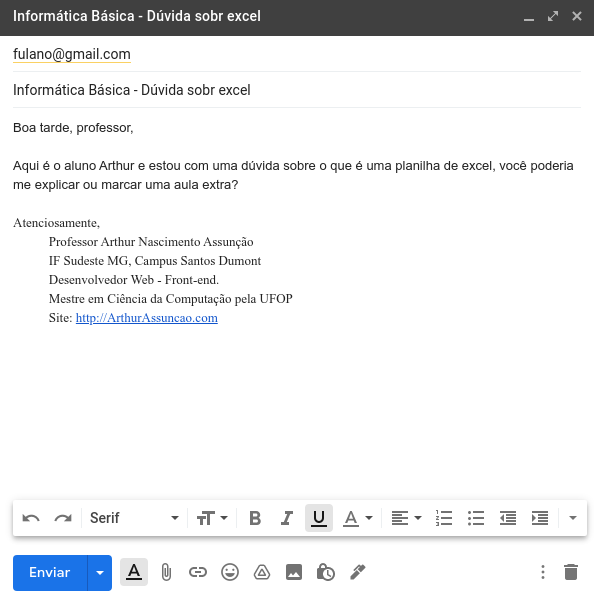

# 8. Utilizando e-mail

E-mail é um dos meios mais usados de comunicação assíncrona \(sem que o outro veja e responda no mesmo momento\), porém para usar e-mails é preciso criar um e saber escrever mensagens minimamente corretas.

### 8.1 Criação de e-mail nos principais provedores

Para criar um e-mail no Gmail basta acessar o site do Gmail.com e preencher os campos. Para criar um e-mail no Outlook basta acessar o site do Outlook.com e preencher os campos. Tente criar um e-mail minimamente bonito, quando somos novos criamos e-mails que acabamos nos arrependendo quando mais velhos, então tente usar o seu nome, por exemplo:

* josedasilva@gmail.com
* jose.da.silva@gmail.com

### 8.2 Dicas de como enviar e-mails

Para você ter dicas de como enviar um e-mail preciso explicar quais campos uma mensagem de e-mail tem, eles são:

* **Assunto**: aqui você indica sobre o que é o e-mail, por exemplo: Dúvida sobre Excel. Nunca deixe esse campo em branco.
* **Mensagem**: Dê bom dia, boa tarde ou boa noite, informe o seu nome e de onde você é e escreva a mensagem explicando o motivo do contato, por fim diga Atenciosamente, Fulano.
* **Destinatários**: indique o e-mail das pessoas que vão receber esta mensagem.

Um exemplo de e-mail é apresentado na Figura 15.

 

Lembre:

* Não deixe o campo _Assunto_ em branco.
* Diga no campo de mensagem qual a finalidade do contato e lembre quem é você caso seja um dos primeiros contatos com a pessoa.
* Não envie e-mail, nem mensagem em whatsapp, dizendo apenas "Professor, me tira uma dúvida" ou "Professor, boa tarde", pois assim a mensagem está incompleta, você deve falar tudo que precisa de uma vez.
* Se precisar, anexe arquivos e fotos, na Figura 15, você vê um símbolo de um clipe de papel, é com ele que se anexa arquivos a um e-mail.

